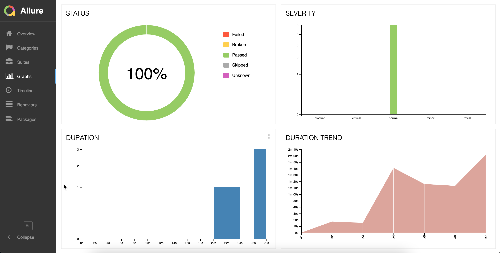
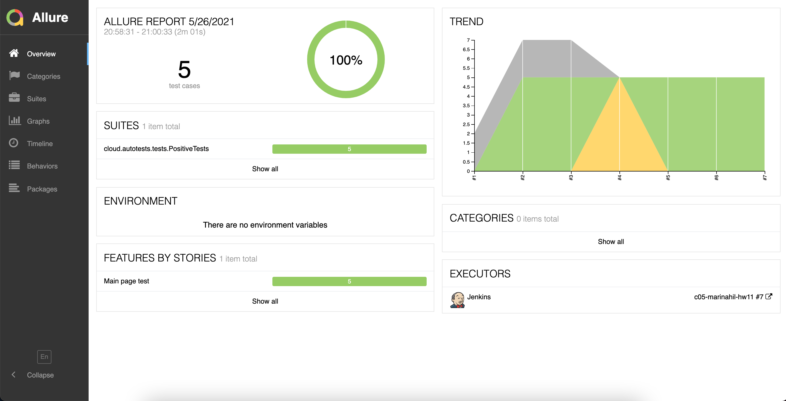
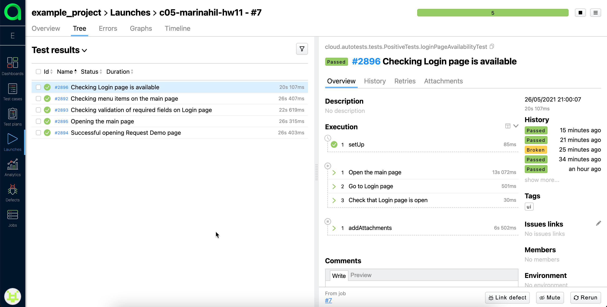
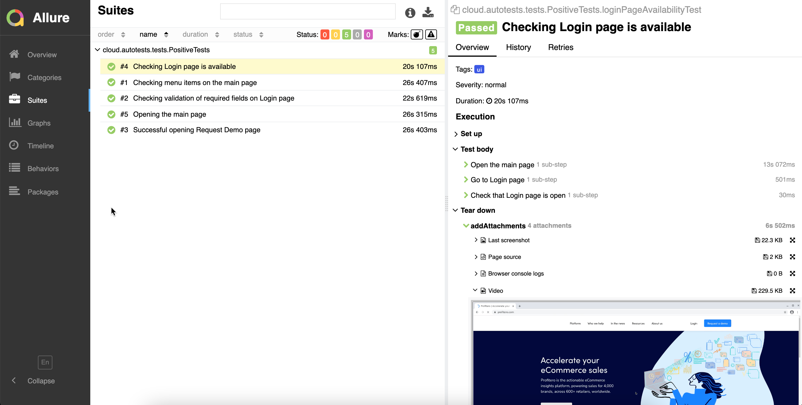
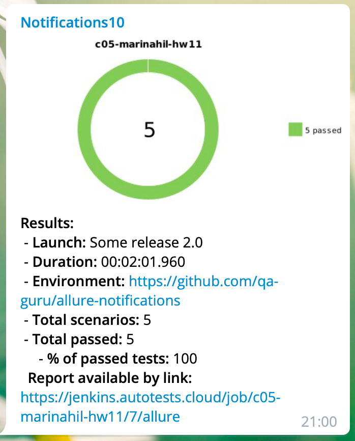

# Пример тестирования сайта с отправкой результатов в телеграмм-чат
https://www.profitero.com/

# Используемые технологии:

`Java` `Gradle` `Junit5` `Selenide` `Selenoid` `Allure Report` `Jenkins` `Telegram Bot`

# Отчет Allure report:
 
 

# Видео прохождения теста:

# Cообщение, отправленное в Telegram:

# Ссылка на проект в Jenkins:
https://jenkins.autotests.cloud/job/c05-marinahil-hw11
